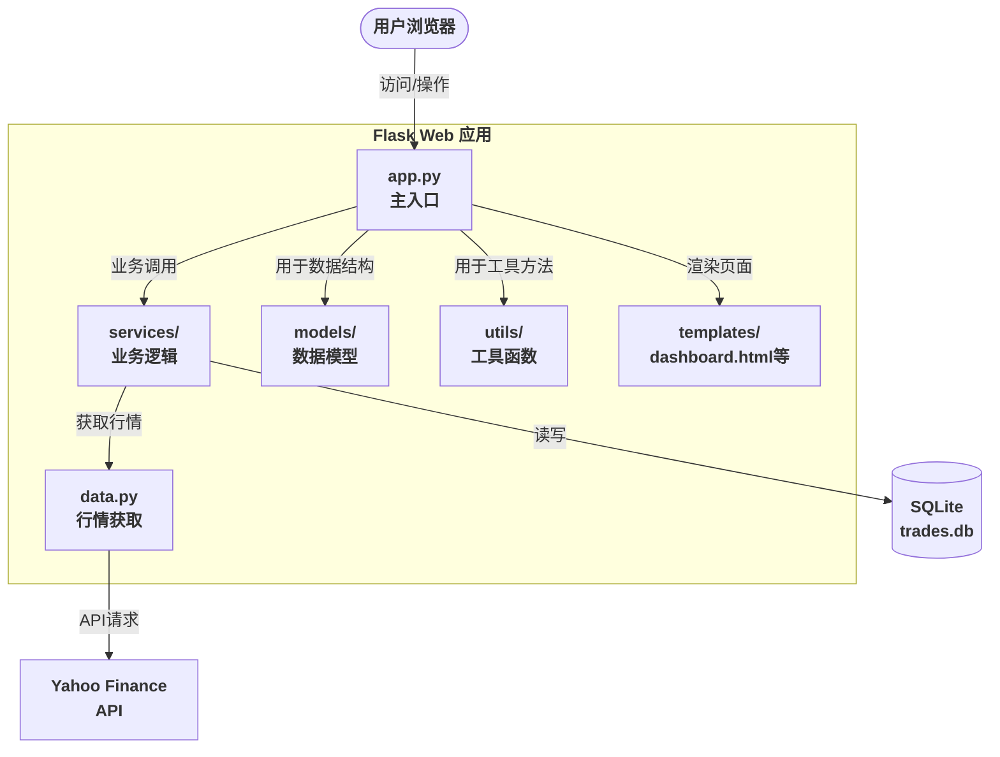

# Stock Trader Flask App

本项目是一个基于 Flask 的股票交易演示应用，使用 Yahoo Finance 获取数据，SQLite 记录交易。


## 目录结构


```text
app.py                  # Flask 主入口
requirements.txt        # 依赖包
stock_trader/
    app_factory.py      # Flask app 工厂
    config.py           # 配置与常量
    data.py             # 数据相关逻辑
    models/             # 数据模型
    services/           # 业务服务
    utils/              # 工具函数
    data/               # 数据库存放目录（trades.db 已移动至此）
templates/
    dashboard.html      # 主仪表盘模板
static/
    dashboard.css       # 仪表盘样式
    dashboard.js        # 仪表盘交互脚本
tests/
    test_trade_service.py # 单元测试
```

## 系统架构

## 系统架构



## 运行方式


```bash
python3 -m venv venv
source venv/bin/activate  # 激活虚拟环境（Mac/Linux）
# .\venv\Scripts\activate  # Windows 下激活
pip install -r requirements.txt
export FLASK_APP=app.py
flask run
# 或直接 python app.py
```


## 说明

- 交易数据库文件已放在 `stock_trader/data/` 目录下，便于管理和备份。
- 静态资源（CSS/JS）已集中在 `static/` 目录，页面更易维护。
- `.gitignore` 已配置忽略缓存和数据库文件。
- 如需添加测试，建议新建 `tests/` 目录。
- 默认初始资金、数据库路径等常量集中在 `stock_trader/config.py`。
